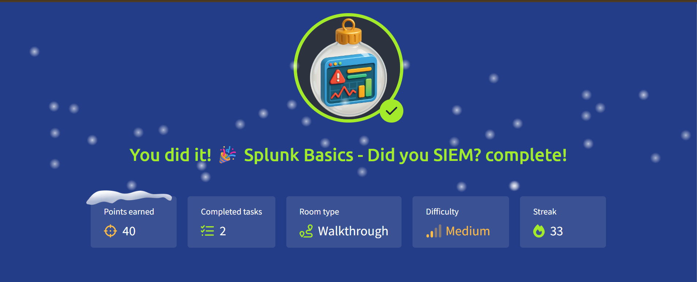

# 🎄 Advent of Cyber 2025 — Day 03

## 📊 Splunk Basics: Turning Logs into Answers

---

## 🔍 Scenario Summary

Just as Wareville’s Christmas operations gain momentum, the **SOC dashboard lights up red**. A ransom message from **King Malhare of HopSec Island** confirms the worst — TBFC’s systems have been actively targeted. With McSkidy still missing, the responsibility to investigate the breach falls squarely on the SOC team.

To uncover what happened, how it happened, and how far the attacker progressed, the team relies on **Splunk**, TBFC’s SIEM platform.  
Day 03 focuses on analyzing pre-ingested logs to **trace the full attack chain**, from initial probing to ransomware execution.

---

## 🧩 Step-by-Step Investigation

### 📌 Task 1 — Exploring Available Logs

The investigation begins inside Splunk’s **Search & Reporting** interface.

Initial actions included:

- Querying all data using a broad search
- Expanding the timeframe to cover **all historical events**
- Identifying available data sources

Two primary log categories were discovered:

- Web server activity logs
- Firewall and network traffic logs

This step established the dataset required for effective triage.

---

### 📌 Task 2 — Visualizing Event Trends

To understand _when_ the attack occurred, log volume was visualized over time.

The resulting trend revealed:

- Consistent baseline traffic on normal days
- A sharp and unusual spike aligned with the attack window

This immediately narrowed the timeframe and confirmed malicious activity rather than routine noise.

---

### 📌 Task 3 — Identifying Suspicious Patterns

With the timeline defined, attention shifted to anomaly detection across key fields:

- **User agents** showed a deviation from standard browsers, indicating automation
- **Client IPs** revealed one source dominating suspicious requests
- **Request paths** exposed probing attempts, traversal patterns, and payload delivery

Together, these indicators painted a clear picture of an active attacker rather than random traffic.

---

### 📌 Task 4 — Noise Reduction & Isolation

Legitimate traffic was filtered out to reduce clutter and false positives.

Once common browsers and benign requests were excluded:

- A single attacker IP remained dominant
- Request behavior appeared scripted and repetitive
- Scanning and exploitation attempts became unmistakable

This step allowed the investigation to focus purely on malicious behavior.

---

### 📌 Task 5 — Reconstructing the Attack Chain

Using targeted searches, the attacker’s actions were mapped end-to-end:

- **Reconnaissance:** Automated tools probing sensitive files and configurations
- **Enumeration:** Traversal attempts and access testing
- **Exploitation:** Evidence of SQL injection payloads and exploitation frameworks
- **Exfiltration:** Attempts to download backups and large files
- **Execution:** Deployment of a webshell and ransomware binary
- **C2 Activity:** Outbound connections from the compromised host to the attacker

This confirmed a **complete compromise**, not just a failed attempt.

---

## 🎯 Objectives Achieved

- Navigated and queried data within a SIEM
- Visualized log activity to detect anomalies
- Isolated malicious traffic from normal behavior
- Traced an attacker’s full kill chain
- Understood how SOC teams investigate real incidents

---

## 📚 Key Learnings

- How Splunk organizes data using indexes and fields
- Performing effective initial triage with broad searches
- Using patterns to identify attacker tooling
- Applying SIEM workflows for incident investigation
- Understanding why visibility is critical in response scenarios

---

## 💡 Core Insight

> **Logs tell the entire story — a SIEM simply gives them a voice.**

---

## 📸 Completion Evidence

---

## ➡️ What’s Next

Continue to **Day 04**, where the investigation expands further into advanced attack and defense techniques.
