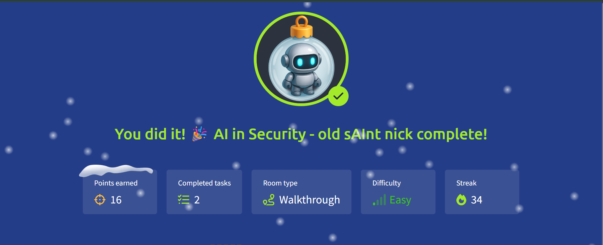

# 🎄 Advent of Cyber 2025 — Day 04

## 🤖 AI in Cyber Security: Working Alongside Van SolveIT

---

## 🔍 Scenario Summary

At **The Best Festival Company (TBFC)**, the pressure of Christmas operations continues to rise — and this year, the elves have introduced a new digital helper. Their legacy chatbot could no longer keep pace, leading to the rollout of an AI-powered security assistant known as **Van SolveIT**.

Designed to assist across **defensive, offensive, and software security tasks**, Van SolveIT aims to reduce manual effort, accelerate analysis, and support decision-making.  
Day 04 explores how AI fits into real-world cyber security workflows, highlighting both its advantages and the caution required when relying on intelligent systems.

---

## 🧩 Step-by-Step Investigation

### 📌 Task 1 — Understanding AI’s Role in Cyber Security

The first task introduces how AI is embedded into modern security operations.

Key observations included:

- AI excels at processing **large-scale data** such as logs and alerts
- Behavioural anomaly detection is significantly faster with AI support
- Generative AI can summarise incidents and explain complex attack flows
- Both defensive and offensive teams benefit from AI-driven assistance

This task establishes AI as an _enabler_, not a standalone solution.

---

### 📌 Task 2 — Security Use Cases for AI

AI applications were explored across multiple domains:

**Defensive Operations**

- Faster alert triage
- Improved context enrichment
- Log correlation and response automation

**Offensive Operations**

- Accelerated reconnaissance
- Noise reduction from scans
- Assistance in exploit development and testing

**Software Security**

- Source code review support
- Automated vulnerability detection
- Developer guidance during secure coding

A key takeaway here is that AI can identify issues effectively — but still struggles to consistently produce secure code without oversight.

---

### 📌 Task 3 — Risks and Limitations of AI

This task highlights why AI must be used responsibly, especially in security-critical environments.

Considerations included:

- Incorrect outputs or hallucinations
- Misjudged vulnerability severity
- Data privacy and training transparency
- Unpredictable behaviour during exploitation tasks
- The necessity of **human validation**

The conclusion is clear: AI augments expertise but cannot replace it.

---

### 📌 Task 4 — Hands-On with Van SolveIT

The final task provides a practical demonstration of AI-assisted workflows:

- **Red Team:** AI-assisted exploitation against a vulnerable target
- **Blue Team:** AI-supported analysis of web attack logs
- **Software Security:** Source code review and vulnerability identification

Successful completion across all three domains confirms how a single AI assistant can support multiple security roles within one environment.

---

## 🎯 Objectives Achieved

- Understood how AI integrates into cyber security operations
- Identified real-world AI use cases across teams
- Practiced AI-assisted red, blue, and software security tasks
- Recognised operational and ethical risks of AI usage

---

## 📚 Key Learnings

- AI significantly accelerates analysis and triage
- AI works best when paired with skilled professionals
- Blind trust in AI outputs introduces serious risk
- Automation improves efficiency but not accountability
- Responsible AI usage is critical in security environments

---

## 💡 Core Insight

> **AI increases speed and scale — human judgment preserves accuracy and safety.**

---

## ➡️ What’s Next

Proceed to **Day 05** and continue exploring advanced concepts within Advent of Cyber 2025.
