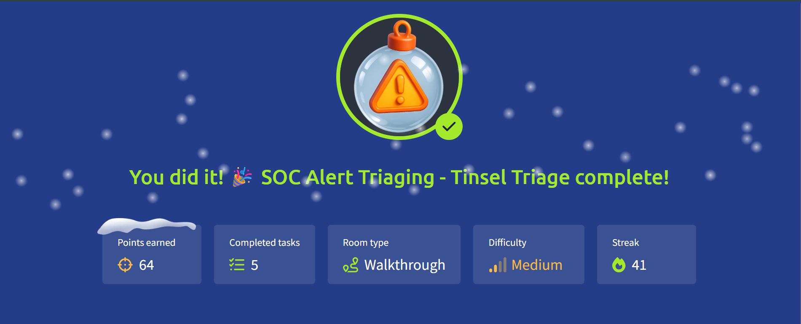

# 🎄 Advent of Cyber 2025 — Day 10

## 🚨 SOC Alert Triaging: Tinsel Triage

---

## 🔍 Scenario Summary

The Security Operations Center at **The Best Festival Company (TBFC)** is overwhelmed. Dashboards in **Microsoft Sentinel** are flooding with alerts, many potentially linked to activity from the Evil Bunnies. With limited time and resources, analysts must decide **what matters now** and **what can wait**.

Day 10 focuses on the real-world skill of **SOC triage** — prioritising alerts, correlating incidents, and investigating suspicious cloud and Linux activity using Sentinel and KQL.

---

## 🧩 Step-by-Step Investigation

### 📌 Task 1 — Alert Triage Fundamentals

The first task establishes why triage is critical during alert storms. Analysts cannot treat all alerts equally.

Key triage dimensions include:

- Alert severity and confidence
- Timing and repetition of events
- Stage within the attack lifecycle
- Criticality of the affected asset

These factors help separate genuine threats from background noise.

---

### 📌 Task 2 — Investigating Incidents in Microsoft Sentinel

Using the Sentinel incident dashboard, attention is directed toward **high-severity incidents**.

The investigation process involved:

- Reviewing affected entities and alert metadata
- Examining MITRE tactic mappings
- Opening full incident timelines
- Correlating related alerts across the same host

A Linux privilege escalation alert revealed multiple linked events, suggesting coordinated attacker activity rather than isolated anomalies.

---

### 📌 Task 3 — Correlating Alerts into an Attack Chain

Multiple alerts tied to the same systems revealed a clear progression:

- External SSH access indicating initial entry
- Enumeration of SUID binaries
- Privilege escalation indicators
- Kernel module insertion for persistence

This correlation transforms individual alerts into a **coherent intrusion narrative**, a key SOC skill.

---

### 📌 Task 4 — Deep Log Analysis with KQL

To validate findings, raw logs were queried directly using **KQL**.

Log analysis exposed:

- Unauthorized modifications to user privileges
- Attempts to access sensitive files
- Execution of suspicious reverse shell commands
- Kernel-level persistence actions

These findings confirmed attacker escalation and persistence within the environment.

---

## 🎯 Objectives Achieved

- Applied structured triage during alert overload
- Investigated cloud and Linux incidents in Microsoft Sentinel
- Correlated alerts to reconstruct attack paths
- Used KQL for detailed log inspection
- Identified privilege escalation and persistence behavior

---

## 📚 Key Learnings

- Alert volume alone does not equal incident severity
- Context and correlation define true risk
- SIEM tools amplify analyst effectiveness
- KQL provides deep visibility beyond dashboards
- Effective triage is essential for timely response

---

## 💡 Core Insight

> **Alert storms are inevitable — disciplined triage is what turns chaos into clarity.**

---

## ➡️ What’s Next

Proceed to **Day 11** and continue strengthening SOC investigation and response skills.
