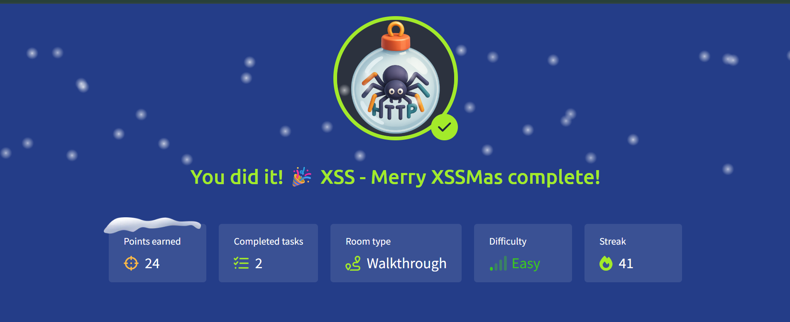

# 🎄 Advent of Cyber 2025 — Day 11

## 🎯 XSS Exploitation: Merry XSSMas

---

## 🔍 Scenario Summary

McSkidy’s secure messaging portal begins behaving unpredictably. Messages look unusual, logs contain unexpected entries, and even Santa’s correspondence appears to be executing as code. These symptoms point toward a familiar but dangerous web vulnerability.

Day 11 focuses on **Cross-Site Scripting (XSS)** — exploring how untrusted input can become executable JavaScript and how both **reflected** and **stored** XSS can be abused to compromise users.

---

## 🧩 Step-by-Step Investigation

### 📌 Task 1 — Understanding XSS

The first task introduces XSS as a client-side injection flaw that occurs when applications fail to sanitize user input.

Two primary variants are examined:

- **Reflected XSS:**  
  Payloads are immediately reflected in server responses and typically delivered via crafted links.

- **Stored XSS:**  
  Payloads are saved on the backend and executed whenever any user loads the affected page.

The distinction highlights why stored XSS carries a much higher impact.

---

### 📌 Task 2 — Exploiting Reflected XSS

The portal’s search functionality is tested for unsafe input handling.

By injecting a simple script into the search field:

- The browser executes the payload instantly
- An alert confirms successful execution
- Server logs reflect the injected input

This confirms the presence of a reflected XSS vulnerability and reveals the first challenge flag.

---

### 📌 Task 3 — Exploiting Stored XSS

The message submission feature is then examined.

By submitting a script as message content:

- The payload is saved on the backend
- Every subsequent page load triggers execution
- The vulnerability persists across sessions

This behavior confirms stored XSS and exposes the second challenge flag.

---

## 🎯 Objectives Achieved

- Understood how XSS vulnerabilities arise
- Differentiated reflected and stored XSS
- Successfully exploited both XSS types
- Observed real-world impact of unsanitized input
- Reviewed core XSS mitigation strategies

---

## 📚 Key Learnings

- Browsers trust application output by default
- Unsanitized input becomes executable code
- Stored XSS poses long-term risk to all users
- Input encoding is as important as validation
- Client-side security flaws can have systemic impact

---

## 💡 Core Insight

> **Every input field is a potential execution point if trust is misplaced.**

---

## 📸 Completion Evidence

---

## ➡️ What’s Next

Proceed to **Day 12** and continue uncovering vulnerabilities hidden within festive systems.
