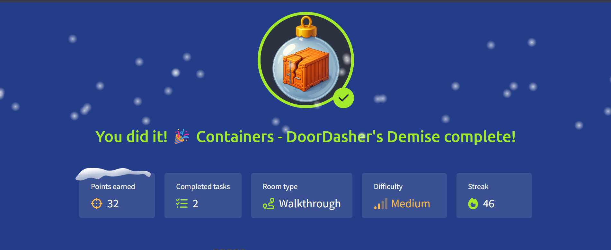

# 🎄 Advent of Cyber 2025 — Day 14

## 🐳 Containers & Privilege Escalation: DoorDasher’s Demise

---

## 🔍 Scenario Summary

As Wareville wakes up, another crisis unfolds. **DoorDasher**, the food delivery service relied upon by TBFC staff, has been compromised by **King Malhare** and rebranded as **Hopperoo**. Public panic erupts after customers discover something far from festive in their meals.

A recovery script exists to restore the service, but the responsible engineer is locked out. The only remaining foothold is a **monitoring pod container** still accessible to the SOC team.

Day 14’s mission is clear: **break out of the container, escalate privileges, regain host-level access, and restore DoorDasher before the damage spreads further.**

---

## 🧩 Step-by-Step Investigation

### 📌 Task 1 — Understanding Containers in Practice

The challenge begins by revisiting why containers are widely used:

- They package applications with dependencies
- They ensure consistency across environments
- They remain lightweight by sharing the host kernel

However, this shared-kernel model also means **misconfigurations can be dangerous**.

---

### 📌 Task 2 — Containers vs Virtual Machines

A clear distinction is reinforced:

- Virtual machines provide full OS isolation
- Containers isolate applications, not the kernel

This difference explains why container escapes are possible when security boundaries are weak.

---

### 📌 Task 3 — Docker Runtime & Attack Surface

Docker’s architecture introduces a critical component:

- The **Docker daemon**, controlled via a Unix socket

If a container can access this socket, it effectively gains the ability to:

- Control other containers
- Spawn privileged workloads
- Interact directly with the host environment

This becomes the core attack vector.

---

### 📌 Task 4 — Identifying Docker Socket Exposure

From inside the monitoring container:

- Running Docker commands succeeds
- The Docker socket is accessible

This confirms that the container has **direct control over the Docker API**, opening the door to escape.

---

### 📌 Task 5 — Escaping the Container

Using Docker access:

- A privileged container is accessed
- Host-level privileges are obtained
- The restricted recovery script becomes reachable

This demonstrates how a single misconfigured container can compromise the entire host.

---

### 📌 Task 6 — Restoring the Service

With elevated privileges:

- The recovery script is executed
- The DoorDasher service is restored
- Normal operations resume

The final step confirms success by retrieving the challenge flag from the system.

---

## 🎯 Objectives Achieved

- Understood containerisation and Docker internals
- Identified dangerous Docker socket exposure
- Escaped a container environment
- Escalated privileges to host level
- Restored a compromised production service

---

## 📚 Key Learnings

- Containers are not security boundaries by default
- Docker socket access equals host-level control
- Least-privilege is critical in container deployments
- Monitoring containers can become attack pivots
- Operational convenience often introduces risk

---

## 💡 Core Insight

> **A container is only isolated until it’s trusted too much.**

---

## 📸 Completion Evidence

---

## ➡️ What’s Next

Proceed to **Day 15** of Advent of Cyber 2025 and continue following the trail left by King Malhare.
