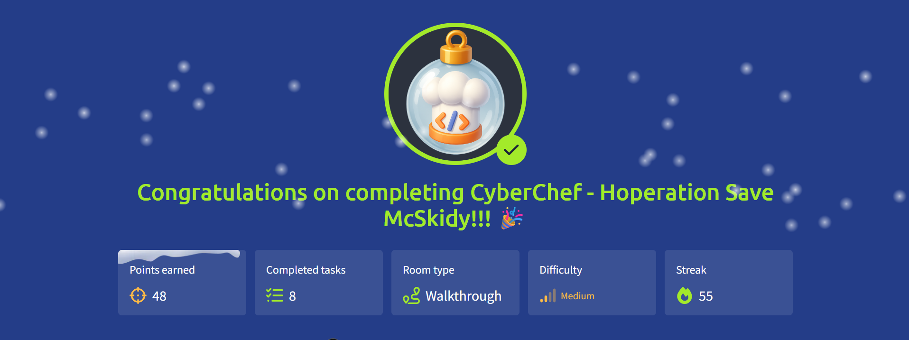

# 🎄 Advent of Cyber 2025 — Day 17

## 🍳 CyberChef & Encoding Analysis: Hoperation Save McSkidy

---

## 🔍 Scenario Summary

McSkidy has been captured and locked away inside **King Malhare’s Quantum Warren**. To prevent escape, **Sir BreachBlocker III** implemented a series of logical barriers, each protected by different encoding and authentication mechanisms.

Before being taken, McSkidy managed to leak clues using seemingly innocent **bunny images**. These hints reveal that **five separate locks** guard the escape route.  
Day 17 tasks the Blue Team with dismantling each lock by inspecting web logic, decoding data, abusing weak protections, and using **CyberChef** to reverse layered transformations.

---

## 🧩 Step-by-Step Investigation

### 📌 Task 1 — Encoding vs Decoding Fundamentals

The challenge begins by reinforcing a critical distinction:

- **Encoding** ensures compatibility and safe data transfer
- **Decoding** reverses encoded data back to its original form

Encoding is _not_ designed for security, making it a frequent source of flawed protection mechanisms.

---

### 📌 Task 2 — Introducing CyberChef

CyberChef is introduced as the primary analysis tool.

Key capabilities include:

- Chaining multiple transformations
- Visualizing inputs and outputs in real time
- Rapid experimentation with encoding and decoding logic

This makes it ideal for reversing layered obfuscation techniques.

---

### 📌 Task 3 — Inspecting Web Logic and Headers

Beyond visible content, the investigation examines:

- HTTP response headers
- Client-side JavaScript logic
- Encoded chat responses

These artefacts expose guard names, magic questions, recipe IDs, and transformation logic hidden from casual users.

---

### 📌 Task 4 — Breaking the First Three Locks

The initial locks rely on progressively stronger but flawed logic:

- Single Base64 encoding
- Double Base64 encoding
- XOR combined with Base64

By identifying the transformation chain and reversing it in CyberChef, each password is successfully recovered.

---

### 📌 Task 5 — Defeating Hash-Based Protection

One lock uses **MD5 hashing** for password verification.

While hashes cannot be reversed mathematically, known hashes can be:

- Matched against precomputed databases
- Cracked using common lookup techniques

This demonstrates why outdated hashing algorithms remain dangerous.

---

### 📌 Task 6 — Solving Variable Logic with Recipes

The final lock introduces variable decoding logic controlled by a **Recipe ID**.

By matching each ID to its transformation chain and applying the correct CyberChef recipe, the final password is extracted, completing the escape route.

---

## 🎯 Objectives Achieved

- Differentiated encoding from encryption
- Used CyberChef for multi-step decoding
- Extracted intelligence from HTTP headers and JavaScript
- Reversed XOR, ROT, Base64, and hash-based logic
- Bypassed layered authentication mechanisms

---

## 📚 Key Learnings

- Encoding provides no real security
- Client-side logic often exposes critical secrets
- XOR is reversible when keys are reused
- Weak hashes are vulnerable to lookup attacks
- CyberChef excels at rapid decoding workflows

---

## 💡 Core Insight

> **Encoding only delays attackers — understanding the recipe breaks the lock.**

---

## 📸 Completion Evidence

---

## ➡️ What’s Next

Proceed to **Day 18** of Advent of Cyber 2025 and continue the rescue mission.
