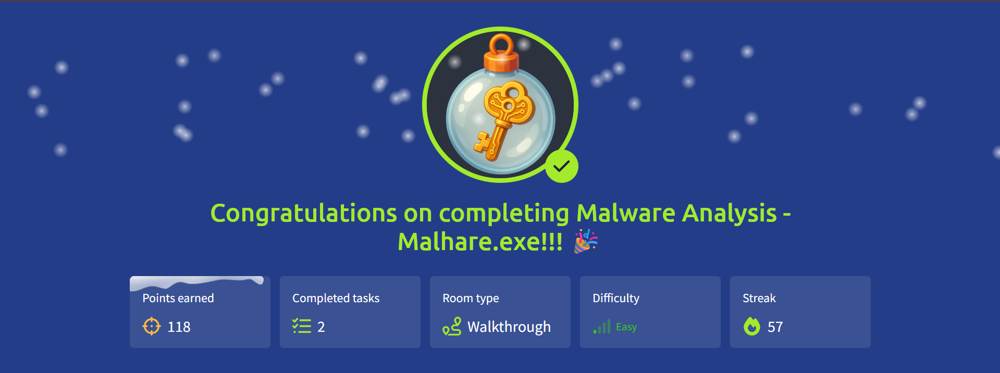

# 🎄 Advent of Cyber 2025 — Day 21

## 🧬 Malware Analysis: Malhare.exe (HTA Abuse)

---

## 🔍 Scenario Summary

At TBFC, thousands of files circulate daily — documents, scripts, utilities, and attachments that look routine at first glance. Hidden among them, however, are files crafted by **King Malhare** to exploit trust rather than technical flaws.

Day 21 centers on one such file type: **HTA (HTML Application)**.  
Disguised as an innocent employee survey, a malicious HTA quietly executed code, harvested system information, and sent it off-site — all without triggering obvious alarms.

The objective was to **analyze the HTA safely**, understand its execution flow, decode its obfuscated payload, and determine **what data was stolen and how**.

---

## 🧩 Step-by-Step Investigation

### 📌 Task 1 — Understanding HTA Files

HTA files are essentially HTML applications executed by **mshta.exe**, granting them:

- Native execution privileges
- Access to Windows scripting engines
- Freedom from browser sandbox restrictions

While designed for internal automation, these same properties make HTAs attractive for malware authors.

---

### 📌 Task 2 — Recognising HTA Abuse

Malicious HTAs often:

- Arrive via phishing attachments
- Use social engineering themes (surveys, invoices, forms)
- Spawn PowerShell or system commands
- Obfuscate payloads using encoding

This case followed the pattern exactly.

---

### 📌 Task 3 — Safe Static Inspection

The suspicious file was opened **without execution** using a text editor.  
Initial inspection revealed:

- A legitimate-looking application title
- Embedded VBScript logic
- Multiple encoded strings and external URLs

This confirmed the file was more than a simple survey.

---

### 📌 Task 4 — Breaking Down the VBScript Logic

Analysis revealed several key functions:

- An auto-executing routine triggered on load
- A function masquerading as a question downloader
- A feedback routine quietly collecting host details
- Helper functions decoding Base64 content

Together, these formed a clear execution chain from user interaction to data theft.

---

### 📌 Task 5 — Dangerous Objects in Use

The script instantiated powerful Windows objects:

- Objects capable of launching commands
- Components used for system enumeration
- Network-capable interfaces for outbound communication

These objects enabled execution, reconnaissance, and exfiltration from within a single file.

---

### 📌 Task 6 — Deobfuscating the Payload

The downloaded content was protected by layered obfuscation:

1. Base64 encoding
2. ROT-based transformation

Reversing these layers revealed the final payload and confirmed malicious intent.

---

### 📌 Task 7 — Identifying Exfiltration

The analysis showed that:

- Hostname and username were collected
- Data was sent to an external endpoint
- The transfer used a simple HTTP GET request

This confirmed successful data exfiltration rather than a failed attempt.

---

## 🎯 Objectives Achieved

- Understood how HTA files execute on Windows
- Identified malicious VBScript logic
- Traced execution flow from load to payload
- Decoded obfuscated data safely
- Determined exfiltrated information and destination

---

## 📚 Key Learnings

- HTAs bypass browser security entirely
- Social engineering is often embedded directly into code
- Obfuscation hides intent, not capability
- Base64 and ROT are commonly chained together
- “Legitimate” scripting features are frequently abused

---

## 💡 Core Insight

> **Malware doesn’t always arrive as an executable — sometimes it arrives as a survey asking for feedback.**

---

## 📸 Completion Evidence

---

## ➡️ What’s Next

Proceed to **Day 22** of Advent of Cyber 2025 and continue dismantling Malhare’s remaining operations.
