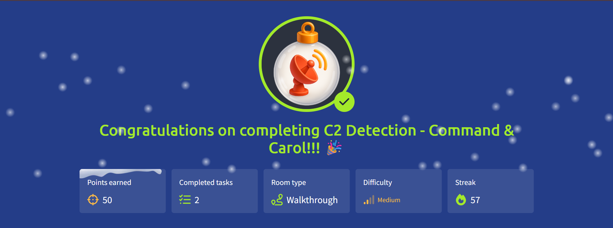

# 🎄 Advent of Cyber 2025 — Day 22

## 🎶 C2 Detection & Threat Hunting: Command & Carol

---

## 🔍 Scenario Summary

With King Malhare’s campaigns growing quieter but more calculated, TBFC shifts from reactive defense to **proactive threat hunting**.  
Rather than waiting for alerts, **Sir Elfo** proposes analyzing raw network traffic to uncover hidden **Command & Control (C2)** channels that blend into normal-looking connections.

Day 22 focuses on turning noisy packet captures into **actionable intelligence** using **Zeek** and **RITA**, enabling defenders to spot beaconing behavior, suspicious domains, and covert infrastructure before damage escalates.

---

## 🧩 Step-by-Step Investigation

### 📌 Task 1 — From Packets to Intelligence

Raw PCAP files contain everything — and that’s the problem.  
The first step is transforming packets into structured telemetry:

- Convert PCAPs into **Zeek logs**
- Extract connection, DNS, HTTP, and TLS metadata
- Prepare data for higher-level analytics

This translation turns raw traffic into something analysts can reason about.

---

### 📌 Task 2 — Why Zeek Comes First

RITA doesn’t analyze packets directly. It relies on **Zeek-generated logs** because they:

- Normalize network behavior
- Preserve timing and connection patterns
- Expose protocol-level context without payload inspection

Zeek acts as the lens through which traffic becomes understandable.

---

### 📌 Task 3 — Importing Data into RITA

Once Zeek logs are generated, they’re imported into **RITA** for analysis.

RITA correlates:

- Connection intervals
- Source/destination relationships
- Beacon regularity
- DNS and TLS anomalies

This correlation is what reveals **C2-like behavior** hiding in plain sight.

---

### 📌 Task 4 — Reading RITA’s Results

RITA’s interface surfaces suspicious activity through:

- Severity scores
- Beacon likelihood
- Connection duration patterns
- Host prevalence indicators

Threat modifiers help explain _why_ a connection stands out — not just that it does.

---

### 📌 Task 5 — Identifying Malicious Infrastructure

Analysis highlights:

- Rare domains with repeated, periodic connections
- Long-lived sessions over uncommon ports
- Destinations confirmed as malicious via threat intelligence

These traits collectively point to **active C2 infrastructure**, even when no single indicator looks extreme on its own.

---

### 📌 Task 6 — Applying the Workflow to a New Capture

The same process is repeated on a second PCAP:

1. Convert to Zeek logs
2. Import into RITA
3. Filter and analyze results

This validates the methodology and confirms multiple compromised hosts communicating with attacker-controlled domains.

---

## 🎯 Objectives Achieved

- Converted PCAP files into Zeek logs
- Imported and analyzed data using RITA
- Detected C2 beaconing patterns
- Interpreted threat modifiers and metadata
- Practiced proactive network threat hunting

---

## 📚 Key Learnings

- PCAPs are raw evidence, not answers
- Metadata analysis reveals behavior, not just events
- Beaconing patterns matter more than payloads
- Prevalence helps separate noise from true threats
- Threat hunting is about context and correlation

---

## 💡 Core Insight

> **Packets tell stories — analytics help you hear them.**

---

## 📸 Completion Evidence

---

## ➡️ What’s Next

Proceed to **Day 23** of Advent of Cyber 2025 and continue uncovering Malhare’s hidden infrastructure.
