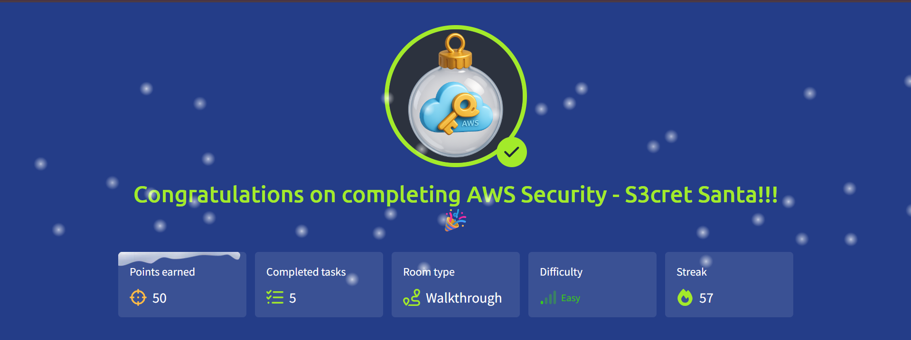

# 🎄 Advent of Cyber 2025 — Day 23

## ☁️ AWS Cloud Security: S3cret Santa

---

## 🔍 Scenario Summary

One of TBFC’s undercover elves manages to sneak into **Sir Carrotbane’s office** and stumbles upon something far more dangerous than chocolate eggs — **AWS cloud credentials**, left unsecured on a desktop.

These credentials could be the missing link to reclaiming TBFC’s compromised cloud environment.

Day 23 focuses on **cloud enumeration from an attacker’s perspective**:

- Identifying AWS identities
- Enumerating IAM permissions
- Exploiting `sts:AssumeRole`
- Accessing sensitive data stored in S3

---

## 🧩 Step-by-Step Investigation

### 📌 Task 1 — Verifying the AWS Identity

With credentials already configured in the AWS CLI, the first step is identifying **who we are** in the cloud.

Using STS identity checks confirms:

- The AWS account number
- The IAM user tied to the credentials
- The privilege boundary of the compromised user

This establishes our initial access point inside TBFC’s AWS account.

---

### 📌 Task 2 — Understanding IAM Permissions

IAM governs:

- **Who** can act
- **What** actions they can perform
- **Which** resources are accessible

Policy analysis reveals that permissions are not excessive — but one stands out:  
the ability to **assume roles**, a common path to privilege escalation in AWS.

---

### 📌 Task 3 — Enumerating User Policies

Inspection of attached and inline policies shows:

- A custom policy bound to the compromised user
- Explicit permission to call `sts:AssumeRole`

This single permission becomes the pivot point for deeper access.

---

### 📌 Task 4 — Discovering IAM Roles

Listing roles uncovers a particularly interesting one:

- A role designed for managing storage resources

By reviewing its policies, it becomes clear this role grants:

- Visibility across S3 buckets
- Permission to read objects

This role is the gateway to TBFC’s hidden cloud data.

---

### 📌 Task 5 — Assuming the Role

Using AWS STS:

- Temporary credentials are generated
- The session identity shifts from user to role
- Privileges are effectively escalated

Verifying the identity confirms successful role assumption.

---

### 📌 Task 6 — Enumerating and Accessing S3

With new permissions:

- All S3 buckets are listed
- A suspicious bucket stands out
- Its contents reveal a sensitive file

Downloading the object exposes the secret stored inside — confirming the breach and completing the objective.

---

## 🎯 Objectives Achieved

- Enumerated AWS identity and account details
- Analyzed IAM users, policies, and roles
- Leveraged `sts:AssumeRole` for privilege escalation
- Enumerated S3 buckets and objects
- Exfiltrated sensitive cloud data safely

---

## 📚 Key Learnings

- Cloud breaches often begin with leaked credentials
- IAM misconfigurations enable silent escalation
- `sts:AssumeRole` is a high-risk permission
- S3 frequently contains sensitive secrets
- Enumeration is critical before exploitation

---

## 💡 Core Insight

> **In the cloud, permissions are power — and one role can unlock everything.**

---

## 📸 Completion Evidence

---

## ➡️ What’s Next

Proceed to **Day 24** of Advent of Cyber 2025 and prepare for the final stretch of SOC-mas.
