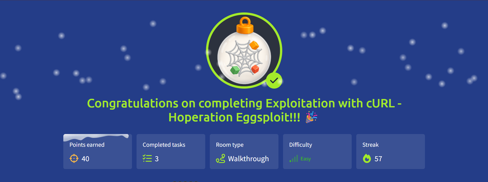

# 🎄 Advent of Cyber 2025 — Day 24

## 🧵 HTTP Exploitation with cURL: Hoperation Eggsploit

---

## 🔍 Scenario Summary

Blue Team intel confirms that **King Malhare’s reinforcements** are sustained by a **wormhole control panel** exposed over HTTP. There’s no browser, no proxy, no GUI—just a terminal.

That’s sufficient.

Day 24 is about **talking to the web server directly**. By crafting raw HTTP requests with **cURL**, we interact with endpoints, manage sessions, brute-force authentication, bypass filters, and ultimately **shut the wormhole down**—one request at a time.

---

## 🧩 Step-by-Step Investigation

### 📌 Task 1 — Speaking HTTP Without a Browser

cURL sends HTTP requests exactly as written—no abstractions.

A simple GET retrieves raw server output:

- Confirms reachability
- Reveals page behavior
- Shows responses exactly as the server sends them

This sets the baseline for manual interaction.

---

### 📌 Task 2 — Submitting Forms with POST

Login forms are just POST requests.

By manually supplying form fields:

- Credentials can be tested
- Error messages observed
- Headers inspected alongside bodies

Viewing full responses helps identify what the application expects—and what it leaks.

---

### 📌 Task 3 — Managing Sessions with Cookies

Sessions rely on cookies, not magic.

By:

- Saving cookies to a file
- Reusing them on subsequent requests

cURL mimics an authenticated browser session, enabling access to protected endpoints without re-authenticating.

---

### 📌 Task 4 — Automating Brute Force Attempts

Shell scripting turns cURL into a lightweight attack engine.

A simple loop:

- Iterates through a password list
- Submits credentials
- Detects success via response content

This demonstrates the mechanics behind tools like Hydra—simple logic, repeated efficiently.

---

### 📌 Task 5 — Bypassing User-Agent Restrictions

Some endpoints block automated tools by checking the **User-Agent** header.

By customizing headers:

- Requests appear legitimate
- Filters are bypassed
- Restricted endpoints become accessible

Header manipulation proves that many defenses rely on **assumptions**, not enforcement.

---

## 🎯 Objectives Achieved

- Crafted GET and POST requests manually
- Inspected raw HTTP responses and headers
- Managed session cookies without a browser
- Automated brute-force logic using bash + cURL
- Bypassed User-Agent based filtering

---

## 📚 Key Learnings

- HTTP is simple—and powerful when used directly
- Browsers are conveniences, not requirements
- Sessions live in cookies, not memory
- Automation amplifies small logic flaws
- Header checks are weak security controls

---

## 💡 Core Insight

> **If you can type it, you can send it — and the server will listen.**

---

## 📸 Completion Evidence

---
