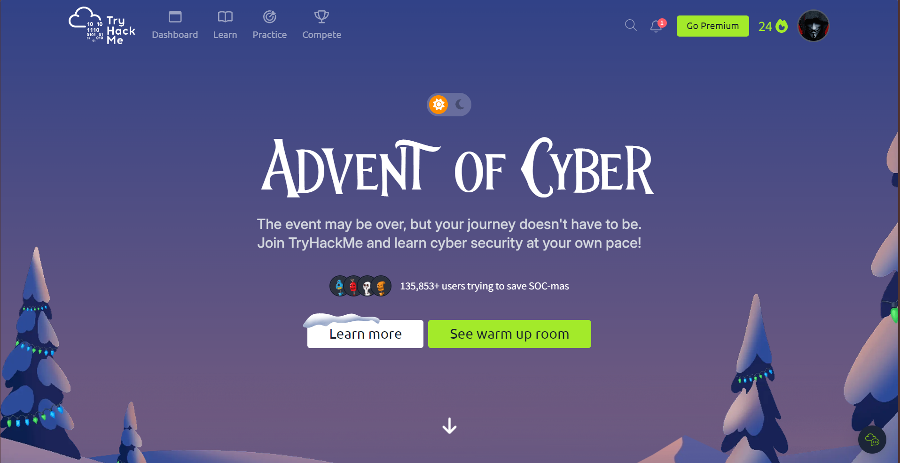

  

# 🎄 Advent of Cyber 2025 — TryHackMe

## 📘 Complete Hands-On Write-Ups & Evidence

Welcome to my **Advent of Cyber 2025** repository.

This repository documents my **end-to-end journey through all 25 days** of **TryHackMe’s Advent of Cyber 2025**, including **detailed write-ups, investigation notes, screenshots, and practical takeaways** for every challenge.

All write-ups are **original**, written step-by-step from a learner and practitioner perspective, and structured to be **clear, readable, and portfolio-ready**.

> ✍️ **Write-ups authored by:** `@thechiranjeevvyas

---

## 📅 What is Advent of Cyber?

**Advent of Cyber** is TryHackMe’s annual December event where:

- **1 hands-on cybersecurity challenge is released every day**
- Challenges span **Beginner → Intermediate → Advanced**
- Each room focuses on **real-world attack and defense scenarios**

Topics covered across the 25 days include:

- 🔵 SOC & Blue Team Investigations
- 🟣 Malware Analysis & Obfuscation
- 🟠 Digital Forensics (Logs, Registry, Network, PCAP)
- 🔴 Web Exploitation & Application Security
- 🟢 Cloud Security (AWS, IAM, S3)
- 🟡 Threat Hunting & SIEM (Splunk, Sentinel, RITA)
- ⚙️ Linux, Windows & Command-Line Skills
- 🧠 AI Security, Prompt Injection & Agent Abuse
- 🏭 ICS / SCADA & Industrial Protocols

Completing all days earns:

- 🏅 **Official Completion Certificate**
- 🏷️ **Advent of Cyber 2025 Badge**
- 📂 A strong **public cybersecurity portfolio**

---

## 🏆 Advent of Cyber 2025 — Certificate

  

✅ Successfully completed **all 25 days**  
✅ Covered offensive, defensive, and forensic domains  
✅ Demonstrated consistent hands-on practice  
✅ Maintained public documentation for every challenge

🔗 **TryHackMe Profile (Verification):**  
`https://tryhackme.com/p/Xpl0itN1nja/

---

## 🧠 Final Note

> “Cybersecurity isn’t about knowing tools — it’s about knowing **when, why, and how** to use them.”

## Advent of Cyber 2025 reinforced that mindset every single day.

If you found this repository useful:

- ⭐ Star the repo
- 🔁 Fork it for reference
- 🧑‍💻 Use it to guide your own Advent of Cyber journey

🎄 Have a Merry SOC-mas and a secure New Year.
